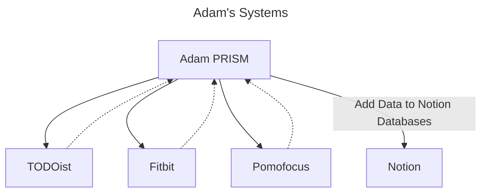

# Adam PRISM

Inspired by the [NSA's PRISM program](https://en.wikipedia.org/wiki/PRISM), I like to track my personal data over time to look for useful trends in managing my mental and physical health. I have a lot of data, but it's disparately managed by services that don't talk to each other well, or at least not in the way I want them to.

## Systems I'm Using

### [Notion](https://www.notion.so/)

My home base. Keeps track of my daily journal, notes, workout tracking, and in-progress projects. This is where I want to hold all my data, and will be writing data from other services to dedicated databases here.

### [TODOist](https://todoist.com/)

My taskmaster. Helps me dump all my ADHD ideas (like this one) into one place and keep me organized and productive at home and work. I want to gather data like:

* Tasks completed
* Tasks created

### [Pomofocus](https://pomofocus.io/app)

A digital [pomodoro timer](https://todoist.com/productivity-methods/pomodoro-technique) that helps keep me on task and force deep work sessions. Has an auto-integration with TODOist, and I want to gather data on how long I stay focused, and on what projects.

### [Fitbit](https://www.fitbit.com/global/us/home)

Tracks my personal health data like sleep, activity, heart rate, etc. I want to import all of that into Notion on a daily basis to track physical health metrics and see how they stack up against other data.

## Goals

* Link all the current services I have in a clean manner so I can coalesce all my personal data in a central place for easy analysis.
* Enable easily adding new integrations

## Anti-Goals

* Add more services. It's complex enough for now.

## Alternatives

I could use something like [IFTTT](https://ifttt.com/) or [Zapier](https://zapier.com/) to automate a lot of this for me (I still might if I hit annoying roadblocks), except for the following:

* I'm cheap. Why spend $20 a month on something I can over-engineer for free?
* I'm already a programmer, abstracting API calls behind their systems just annoys me when I want to do something more granular
